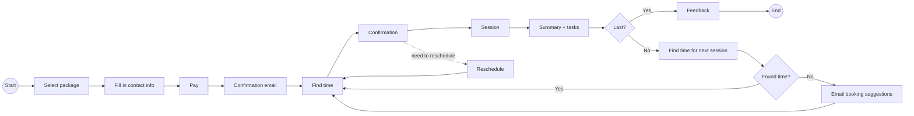

```mermaid
flowchart LR

A((Start)) --> B[Select package]
B --> C[Fill in contact info]
C --> D[Pay]
D --> E[Confirmation email]
E --> HT[Find time]
HT --> BK[Confirmation]

%% Optional reschedule path between booking and session
BK --> S[Session]
BK -. "need to reschedule" .-> BO[Reschedule] --> HT

S --> SU[Summary + tasks]
SU --> LAST{Last?}

LAST -- "Yes" --> FB[Feedback] --> END((End))

LAST -- "No" --> LTS[Find time for next session]
LTS --> HIT{Found time?}

HIT -- "Yes" --> HT
HIT -- "No" --> MB[Email booking suggestions] --> HT
```
